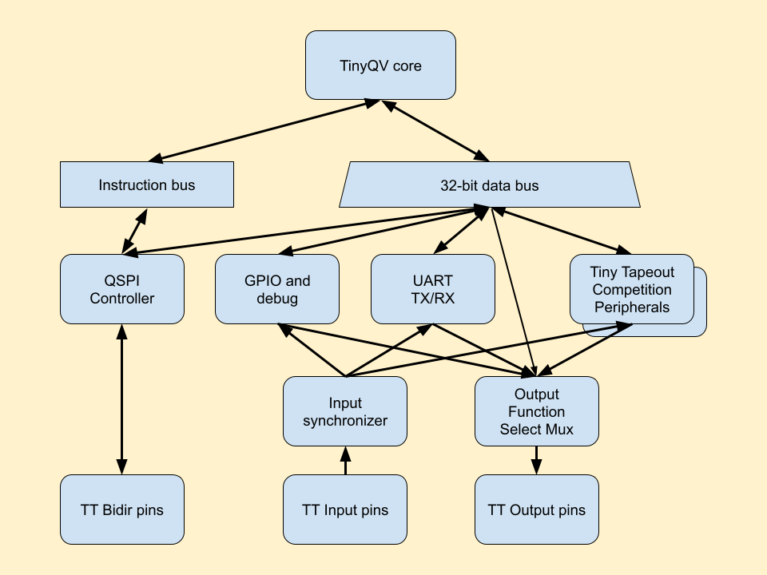
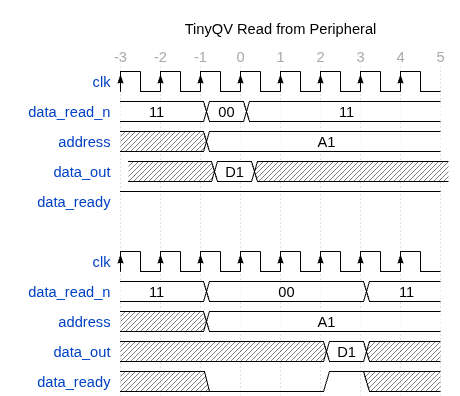
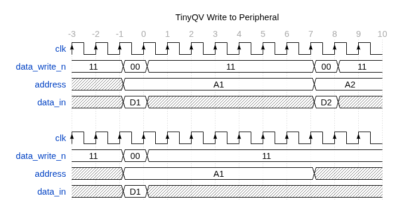

# PRISM + TinyQV on IHP CMOS5L (Jane Street protocol-emulator ASIC entry)

This repository is the IHP SG13CMOS5L port of
[ttsky26a-qv-prism](../ttsky26a/ttsky26a-qv-prism): a PRISM programmable
state-machine engine driven by a TinyQV RISC-V SoC, with the PRISM
configuration held in `CFGMEM_IHP16` latch-array macros built by
[DFFRAM.librelane](../DFFRAM.librelane) (`make cfgmem16_cmos5l` /
`make left_cmos5l`; views in `macros/`). It starts from
`TinyTapeout/ttihp-verilog-template@cmos5l` (workflows, devcontainer, config
defaults) as the competition rules require.

Platform-specific RTL is guarded: `SIM` selects behavioural models,
`SCL_sky130_fd_sc_hd` the original sky130 cells, and the fall-through
branches use `sg13cmos5l_*` cells (same pin names). LibreLane defines the
`SCL_<library>` macro at synthesis.

## Hardening locally

The single-layer Tiny Tapeout PDN cannot reach the macros' Metal4 power pins
on its own (pdngen carves its stripes around macros), so the flow gets one
extra step, `Project.ExtendPowerStripes` (`odb_stripes.py`), that draws the
tile stripes across each macro's pin columns.  The step is a LibreLane
plugin (`librelane_plugin_prism_pdn.py`): LibreLane imports any
`librelane_plugin_*` module it finds on the Python path, and running
`python -m librelane` from the repository root, which is what
`tt_tool.py --harden` and therefore the Tiny Tapeout GDS action do, puts the
root on that path.  `meta.substituting_steps` in `src/config.json` then
inserts the step after `OpenROAD.GeneratePDN`.  Nothing has to be installed
and the CI build gets the same connected macro power as the local one.

The tile's stripes run on a 44.96 um pitch with 5.62 um between VPWR and
VGND: the IHP SRAM's power-column grid (4 x 11.24 um), which the CFGMEM
macros were regenerated to match, so one set of full-height stripes powers
the macros and the SRAM.  With `FP_PDN_VOFFSET` 6.15 the first VPWR stripe
is at 9.03 um; CFGMEM macros go at x = -2.41 + 44.96k um, the SRAM at
3.36 + 11.24i um, all on row boundaries (n x 3.78 um).

    git clone -b cmos-8x4 https://github.com/kdp1965/tt-support-tools tt   # once
    make venv          # once: Python environment for tt_tool.py (.venv-tt)
    make harden-tt     # exactly what CI runs: tt_tool.py --harden --ihp --no-docker
    make harden        # alternative: flow.py (same step, inserted in Python)

The tile is 8x4 (1724.16 x 710.64 um, the size allowed by the Jane Street
competition).  The upstream `cmos` branch of the TT tools has no 8x4 template;
the `cmos-8x4` branch of the fork adds ours from `tt_8x4/` (see its README),
and the GitHub workflows point the actions at that branch.  `make config`
also installs the template into an upstream checkout.  The CFGMEM macros form
two full-height columns of four: bank A (lo macros, `CFGMEM_IHP_LEFT16`,
pins facing east) at x = 537.11 um and bank B (hi macros, `CFGMEM_IHP16`,
pins facing west) at 1346.39 um, with the PRISM logic in the 478 um
channel between them.  The 1024x32 SRAM FIFO macro sits flush left at the
bottom (3.36, 3.78 um, `FS` so its pins face up into the 117 um corridor
that also holds its wrapper), and TinyQV lives above it under the tile
pins.  A CFGMEM column is a routing wall (Metal2 blocked, Metal3 chopped),
so nothing but the SRAM and its wrapper may sit on the far side of one;
docs/prism_interface.md section 4d.1 records the experiments behind this
and the band-layout alternative kept in `src/config_band_v6.json`.

Results land in `runs/wokwi/final/`.  To look at any step's database in the
OpenROAD GUI, or the GDS in KLayout (both come from the nix shell):

    make gui FILE=runs/wokwi/22-project-extendpowerstripes/tt_um_pettit_js_prism.odb
    make gui RUN_DIR=runs/wokwi_phase6      # final database of another run
    make klayout                            # final GDS of runs/wokwi

---

   

# TinyQV - A Risc-V SoC for Tiny Tapeout

TinyQV is accepting peripherals for tape out on the Tiny Tapeout [ttsky25a shuttle](https://app.tinytapeout.com/shuttles/ttsky25a) as part of the [Tiny Tapeout Risc-V peripheral challenge](https://tinytapeout.com/competitions/risc-v-peripheral/).

To contribute, start from either:
- The [byte peripheral template](https://github.com/TinyTapeout/tinyqv-byte-peripheral-template) for simpler peripherals, or
- The [full peripheral template](https://github.com/TinyTapeout/tinyqv-full-peripheral-template).

Further reading:
- [Documentation for project](docs/info.md)
- [More details about tinyQV](https://github.com/MichaelBell/tinyQV/tree/ttsky25a)
- [tinyQV-sdk for building tinyQV programs](https://github.com/MichaelBell/tinyQV-sdk)
- [Example tinyQV programs](https://github.com/MichaelBell/tinyQV-projects)
- [tinyQV Micropython](https://github.com/MichaelBell/micropython/tree/tinyqv-sky25a)

## TinyQV SoC Diagram

## Peripheral data transaction timing

### Read transactions

`data_read_n` signals when there is a read and indicates the transaction width, encoded as in RV32 load instructions: 0, 1 or 2 for 8, 16 or 32-bit.  3 means no transaction.

The read may complete synchronously on the same clock, or be delayed by any number of clocks while the peripheral prepares the data.  `data_ready` signals when the transaction is complete.  `data_out` is sampled on the next clock, its value does not have to be held constant for any additional clocks.  Data for 8 or 16-bit reads should always be aligned to the LSB of `data_out`, even for unaligned reads.

The top diagram shows a synchronous transaction, the bottom diagram shows a delayed transaction.

Reads from the peripheral (loads to TinyQV) happen at most once every 24 clocks.  As long as data_ready is signalled within 7 clocks there is no impact on maximum instruction throughput.

### Write transactions

Writes to the peripheral (stores from TinyQV) happen at most once every 8 clock cycles - the top diagram shows two writes as close together as possible.  The `address` is guaranteed to be stable for 8 clocks starting at the transaction.  Peripherals must accept writes, they can't delay the next transaction.

`data_write_n` signals when there is a write and indicates the transaction width, encoded as in RV32 store instructions: 0, 1 or 2 for 8, 16 or 32-bit.  3 means no transaction.

Data for 8 or 16-bit writes is aligned to the LSB of `data_in`, even for unaligned writes.

The `data_in` is modified between transactions, but due to the quad serial nature of TinyQV it is only modified 4 bits at a time, starting at the least significant bits.  Advanced users could rely on the upper bits being stable for additional clocks.

## What is Tiny Tapeout?

Tiny Tapeout is an educational project that aims to make it easier and cheaper than ever to get your digital and analog designs manufactured on a real chip.

To learn more and get started, visit https://tinytapeout.com.

## Set up your Verilog project

1. Add your Verilog files to the `src` folder.
2. Edit the [info.yaml](info.yaml) and update information about your project, paying special attention to the `source_files` and `top_module` properties. If you are upgrading an existing Tiny Tapeout project, check out our [online info.yaml migration tool](https://tinytapeout.github.io/tt-yaml-upgrade-tool/).
3. Edit [docs/info.md](docs/info.md) and add a description of your project.
4. Adapt the testbench to your design. See [test/README.md](test/README.md) for more information.

The GitHub action will automatically build the ASIC files using [OpenLane](https://www.zerotoasiccourse.com/terminology/openlane/).

## Enable GitHub actions to build the results page

- [Enabling GitHub Pages](https://tinytapeout.com/faq/#my-github-action-is-failing-on-the-pages-part)

## Resources

- [FAQ](https://tinytapeout.com/faq/)
- [Digital design lessons](https://tinytapeout.com/digital_design/)
- [Learn how semiconductors work](https://tinytapeout.com/siliwiz/)
- [Join the community](https://tinytapeout.com/discord)
- [Build your design locally](https://www.tinytapeout.com/guides/local-hardening/)

## What next?

- [Submit your design to the next shuttle](https://app.tinytapeout.com/).
- Edit [this README](README.md) and explain your design, how it works, and how to test it.
- Share your project on your social network of choice:
  - LinkedIn [#tinytapeout](https://www.linkedin.com/search/results/content/?keywords=%23tinytapeout) [@TinyTapeout](https://www.linkedin.com/company/100708654/)
  - Mastodon [#tinytapeout](https://chaos.social/tags/tinytapeout) [@matthewvenn](https://chaos.social/@matthewvenn)
  - X (formerly Twitter) [#tinytapeout](https://twitter.com/hashtag/tinytapeout) [@tinytapeout](https://twitter.com/tinytapeout)
